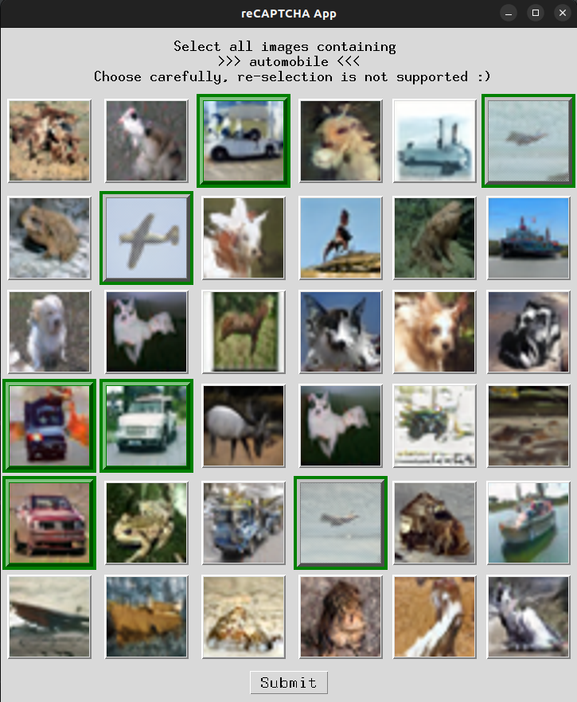

# reCAPTCHA-style Human Classifier App 

---
## For Human Accessor
* Please use the binary in /dist/
* The survey takes about 10 minutes
* There are **4** groups of images and **10** categories for each group.
* Don't recognize trucks as automobile, there is another category for truck
* Don't recognize horse as deer, they are two categories
* For **MacOS** or **Linux** user, please give access in command line, if it doesn't save the csv file
   ```sh
   chmod +x <filename>
   ```
* Send the csv file back to us after finishing the survey.

## Overview

This App is a Tkinter-based application designed to emulate a reCAPTCHA-style interface for validating AI-generated images. The app displays a **6x6** grid of images and prompts the user to select all images corresponding to a specific category.
* There are **4** groups of images and **10** categories for each group.
* Selected images are highlighted, and once selected and submitted, they cannot be chosen again in subsequent questions.
* If there is no matching images for the class, just skip the question and press submit.




## Requirements

- Python 3.x
- Tkinter
- Pillow (PIL)
- pyinstaller
## Installation


1. **Install Dependencies**:
   ```sh
   pip install pillow
   pip install pyinstaller # only necessary for packaging
   ```

2. **Prepare Images**:
   - Ensure you have a folder named `mimicry_result` containing subfolders with your App and don't change it.

## Usage

### Running the App

1. **Run the Script**:
   ```sh
   python reCAPTCHA.py
   ```

### Packaged Executable (Linux)
If you have packaged the application using PyInstaller:
1. **Package the Executable**:
   ```sh
   # Generate a .spec file
   pyinstaller --onefile --windowed reCAPTCHA.py
   # Modify the .spec file according your needs
   # package it
   pyinstaller recaptcha-survey.spec
   ```

2. **Run the Executable**:

   ```sh
   chmod +x recaptcha-survey
   ./recaptcha-survey
   ```

#### Note: Executable files are located in /dist/. **MacOS** binary does not work, since we don't have certificates from an Apple Developer Account 

## License

This project is licensed under the MIT License.

## Contact

For any questions or issues, please contact me.

